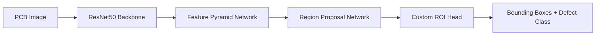
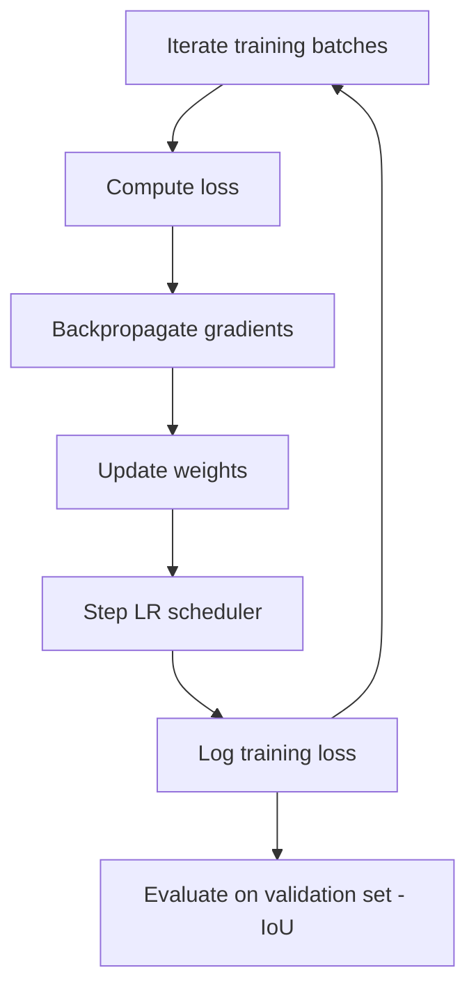

<!-- # Project Title
Implementation of Printed Circuit Board (PCB) defect detection through modern Machine Learning (ML) algorithms.

# Dataset Overview

The dataset  used for this project was obtained from Kaggle  and contains various components such as:
Annotations (XML files )
Images (JPG format )
Rotation 
PCB used
First, I determined the directory structure of the dataset and extracted relevant details from the XML and JPG  files. These details were compiled into a DataFrame  containing the following attributes:
xmin, xmax, ymin, ymax (bounding box coordinates)
class ( defect type)
file ( image file name)
width, height ( image dimensions)
The dataset was then split into training and testing  subsets. The six defect classes were mapped to numerical labels 1 to 6. Using plot_image, the PCBs  were visualized with their bounding boxes.

# Data Preprocessing

A custom PCBData dataset was created to:
1. Load mages and extract bounding box annotations .
2. Normalize and apply necessary transformation to the images Store target data as a dictionary containing:
3. boxes
4. labels
5. image_id
6.  is_crowd
Bounding boxes were visualized to confirm accurate labeling.

# Model Architecture


# Model Preparation
The dataset was split into train_df , valid_df , and test_df . Data was loaded using:
1. num_workers = 6
2. batch_size = 1
3. custom  collate_fn function

A pretrained Faster R-CNN model (FasterRCNN_ResNet50_FPN_Weights.DEFAULT) was used. The final ROI head  layer was replaced with a custom layer.


# Training and Optimization
The model was trained using Adam optimizer , a learning rate scheduler , and ODNN loss computation . The following hyperparameters were used:
1. Learning Rate: 0.0001
2. Weight Decay: 0.0005
3.  StepLR Scheduler: step_size=3, gamma=0.1
4. Epochs: 25
   
The training loop  followed these steps:
1. Iterate through the training dataset and compute loss


 2. Perform gradient backpropagation and then update the weights


Adjust the learning rate scheduler .
Print and log the training loss .
The model was evaluated on the validation set by calculating the Intersection over Union (IoU)  metric
After training, the models  and corresponding loss/IoU curves  were stored for comparison. Then, I plotted  the Loss Measure vs Number of Epochs and IoU Curve vs Number of Epochs. Finally, I used the trained model to predict  bounding boxes on test images  and saved the model path . Later, I developed a refined model  that enhances prediction accuracy  on testing results.

## Result - 


Represents the average IoU value over all the validation data


This shows the reduction of correlation value among network filters

# Conclusion
This project successfully implemented PCB defect detection  using ODNN  and a Faster R-CNN model . The dataset was processed efficiently , and the model was trained with effective loss computation  and optimization techniques . Future improvements can include:
Experimenting with different backbone architectures.
Fine-tuning hyperparameters for better performance.
Implementing real-time defect detection using edge devices.


# Dependencies
 1. Python
 2. PyTorch
 3. torchvision
 4. NumPy
 5. OpenCV
 6. Pandas
 7. Matplotlib
 8. tqdm
 
# Acknowledgments
Special thanks to Kaggle  for providing the dataset  and to the open-source community  for valuable tools and frameworks  that made this project possible!


 -->
<div align="center">

# 🔬 PCB Defect Detection using Deep Learning

### Automated detection of printed circuit board defects with Faster R-CNN

[](https://www.python.org/)
[](https://pytorch.org/)
[](https://pytorch.org/vision/stable/index.html)
[](https://opencv.org/)
[](https://www.kaggle.com/)
[](#)

</div>

<p align="center">
  
  
  
  
</p>

---

## 📑 Table of Contents

- [Project Overview](#-project-overview)
- [Dataset Overview](#-dataset-overview)
- [Data Preprocessing](#-data-preprocessing)
- [Model Architecture](#-model-architecture)
- [Model Preparation](#-model-preparation)
- [Training & Optimization](#-training--optimization)
- [Results](#-results)
- [Conclusion](#-conclusion)
- [Dependencies](#-dependencies)
- [Acknowledgments](#-acknowledgments)

---

## 📌 Project Overview

> Implementation of **Printed Circuit Board (PCB) defect detection** through modern Machine Learning (ML) algorithms — built end-to-end, from raw annotated images to a trained object detector that draws bounding boxes around defects.

---

## 📂 Dataset Overview

The dataset was sourced from **Kaggle** and includes:

| Component | Format | Description |
|---|---|---|
| 🗂️ Annotations | `.xml` | Bounding box + class metadata |
| 🖼️ Images | `.jpg` | Raw PCB images |
| 🔄 Rotation | — | Orientation metadata |
| 🔧 PCB Used | — | Board reference info |

**Pipeline steps:**

1. Determined the dataset's directory structure.
2. Parsed XML annotation files alongside their matching JPG images.
3. Compiled everything into a single **DataFrame** with the columns below:

| Column | Meaning |
|---|---|
| `xmin, xmax, ymin, ymax` | Bounding box coordinates |
| `class` | Defect type |
| `file` | Image file name |
| `width, height` | Image dimensions |

4. Split the data into **training** and **testing** subsets.
5. Mapped the **6 defect classes** to numeric labels `1–6`.
6. Visualized PCBs with their bounding boxes using `plot_image`.

---

## 🧹 Data Preprocessing

A custom **`PCBData`** dataset class was built to:

- ✅ Load images and extract bounding box annotations
- ✅ Normalize and apply the required image transformations
- ✅ Package target data into a dictionary:

```python
target = {
    "boxes": boxes,        # bounding box coordinates
    "labels": labels,      # defect class labels
    "image_id": image_id,  # unique image identifier
    "is_crowd": is_crowd   # crowd annotation flag
}
```

Bounding boxes were re-visualized after preprocessing to confirm label accuracy.

---

## 🏗️ Model Architecture

<p align="center">
  
</p>



---

## ⚙️ Model Preparation

| Setting | Value |
|---|---|
| Data split | `train_df`, `valid_df`, `test_df` |
| `num_workers` | `6` |
| `batch_size` | `1` |
| Collation | custom `collate_fn` |
| Base model | `FasterRCNN_ResNet50_FPN_Weights.DEFAULT` (pretrained) |
| Customization | Final **ROI head** layer replaced |

---

## 🚀 Training & Optimization

<table>
<tr><td>

**Hyperparameters**

| Parameter | Value |
|---|---|
| 🔧 Optimizer | Adam |
| 📉 Learning Rate | `0.0001` |
| ⚖️ Weight Decay | `0.0005` |
| 📐 Scheduler | `StepLR` (`step_size=3`, `gamma=0.1`) |
| 🔁 Epochs | `25` |
| 📊 Loss | ODNN loss computation |

</td></tr>
</table>

**Training loop:**



After training:
- 💾 Models and loss/IoU curves were saved for comparison.
- 📈 Plotted **Loss vs. Epochs** and **IoU vs. Epochs**.
- 🎯 Ran inference on test images and saved the trained model path.
- 🔁 Built a **refined model** that further improves prediction accuracy on test results.

---

## 📊 Results

<details open>
<summary><b>Average IoU over validation data</b></summary>
<br>
<p align="center">
  
</p>
<p align="center"><i>Represents the average IoU value across all validation data.</i></p>
</details>

<details open>
<summary><b>Filter correlation reduction</b></summary>
<br>
<p align="center">
  
</p>
<p align="center"><i>Shows the reduction of correlation among network filters over training.</i></p>
</details>

---

## ✅ Conclusion

This project successfully implemented **PCB defect detection** using an **ODNN-enhanced Faster R-CNN model**. The dataset was processed efficiently, and the model was trained with effective loss computation and optimization techniques.

**🔮 Future Improvements**

- [ ] Experiment with different backbone architectures
- [ ] Fine-tune hyperparameters for better performance
- [ ] Implement real-time defect detection on edge devices

---

## 📦 Dependencies

<p align="left">
  
  
  
  
  
  
  
  
</p>

```bash
pip install torch torchvision numpy opencv-python pandas matplotlib tqdm
```

---

## 🙏 Acknowledgments

Special thanks to **[Kaggle](https://www.kaggle.com/)** for providing the dataset, and to the **open-source community** for the tools and frameworks that made this project possible! 💙

<div align="center">

⭐ If you found this project useful, consider giving it a star!

</div>